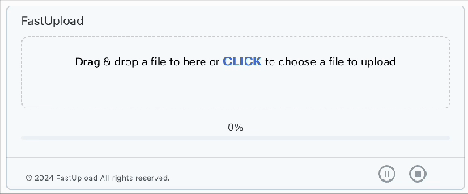
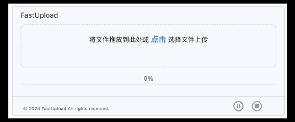

# FastUpload

[English](README.md) | [中文](README.zh.md) | [日本語](README.ja.md)

A React component for asynchronous upload of files of any size based on web worker multi-threading technology





# Features
- Multi-threaded upload, UI page will not be blocked during file upload, users can pause or cancel at any time
- Support for large file uploads
- Real-time upload progress display
- Support for breakpoint resume
- Support for instant upload
- Support for continuous upload
- Multi-language support (currently supports English, Chinese, Japanese)

# Installation and Usage
## Frontend Component Installation
Using npm
```bash
npm install @maxmax117/fastupload
```
Using yarn
```bash
yarn add @maxmax117/fastupload
```
Then add to your React project where appropriate

```html
<FastUpload lang='en'/>
```

## Backend Upload Server Integration
File upload requires backend service support. The FastUpload component is a frontend component and does not provide backend services. You need to implement it yourself using your preferred language and framework (Java, Go, Node.js, Bun.js, Python, PHP, etc.).
To simplify your work, if needed, you can also contact me at <a href="mailto:intellibiz.sh@gmail.com">intellibiz.sh@gmail.com</a>. I have implemented several backend services in different languages (bunjs, java, go) that can be used as standalone microservices out of the box.

If you need to integrate with your own backend service, you can refer to the following steps:

### Implement Backend APIs

- The upload server must implement the following two interfaces:

```js
1. Implement handshake interface
'/upload/shakehands'

    Input parameters：
    const json = {
        fileHash: string,
        fileSize: number,
        fileName: string,
        fileId: string
    };
    Return parameters：
    {
      success: boolean,
      message: string,
      type: 'new',
      fileId: string,
      chunkSize: number,
      status: "PENDING",
        uploadProgress: {
                          totalChunks: number,
                          uploadedChunks: number,
                          percentage: number
                      }
      };
    
2. Implement chunk upload interface
'/upload/chunk'
    Input parameters
    {
      chunk: Blob,
      chunkIndex: number,
      fileId: string,
      clientFileId: string,
      checksum: string
    }
    
    Return parameters：
    {
        success: boolean,
        message: string,
        chunkIndex: number,
        fileId: string,
        size: number,
        isComplete: boolean,
        uploadProgress: {
                            totalChunks: number,
                            uploadedChunks: number
                        }                
    }
```

### Specify Upload Server

```js
  <FastUpload uploadServer='[your server url]' lang='en'/>
```

### Switch Language

```js
  <FastUpload lang='en'/> // English by default
  <FastUpload lang='zh'/> // Chinese
  <FastUpload lang='ja'/> // Japanese
```


